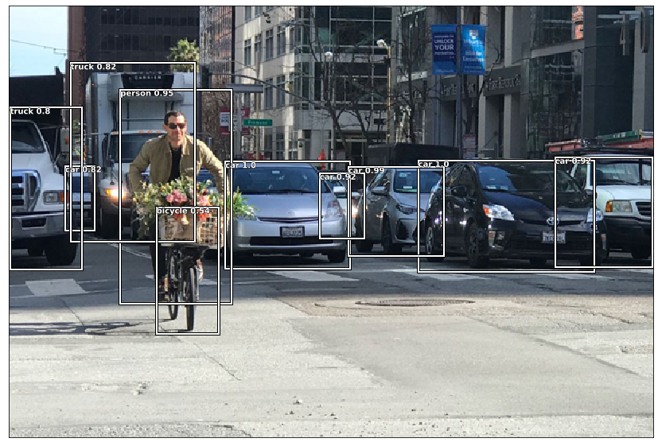

=========
Ultrayolo
=========

.. image:: https://img.shields.io/pypi/v/ultrayolo.svg
        :target: https://pypi.python.org/pypi/ultrayolo

.. image:: https://img.shields.io/travis/fabiofumarola/ultrayolo.svg
        :target: https://travis-ci.org/fabiofumarola/ultrayolo

.. .. image:: https://readthedocs.org/projects/ultrayolo/badge/?version=latest
..         :target: https://ultrayolo.readthedocs.io/en/latest/?badge=latest
..         :alt: Documentation Status

.. image:: https://pyup.io/repos/github/fabiofumarola/ultrayolo/shield.svg
     :target: https://pyup.io/repos/github/fabiofumarola/ultrayolo/
     :alt: Updates

Tensorflow 2.1 implementation of yolo version 3. You only look once (YOLO) is a state-of-the-art, real-time object detection system.

* Free software: Apache Software License 2.0
* Documentation: https://ultrayolo.readthedocs.io.

Features
--------

Ultrayolo implements YOLO object detection paper with the following extensions:

Custom Backbones
^^^^^^^^^^^^^^^^^

- `Darknet <https://pjreddie.com/darknet/yolo/>`_: the original architecture
- `ResNet <https://arxiv.org/abs/1512.03385>`_: *ResNet50V2, ResNet101V2, ResNet152V2*
- `DenseNet <https://arxiv.org/abs/1608.06993>`_: *DenseNet121, DenseNet169, DenseNet201*
- `MobileNetV2 <https://arxiv.org/abs/1608.06993>`_: *MobileNetV2*

Focal Loss
^^^^^^^^^^^

.. _FocalLoss: https://arxiv.org/abs/1708.02002
.. _RetinaNet: https://arxiv.org/abs/1708.02002

Ultrayolo implements the FocalLoss_ for dense object detection such as RetinaNet_. It can be used as alternative by changing the loss function used in the config.

.. code-block:: yaml

   model:
    # The backbone for the model, default DarkNet, accepted values (DarkNetTiny, ResNet50V2, ResNet101V2, ResNet152V2, DenseNet121, DenseNet169, DenseNet201, MobileNet, MobileNetV2)
    backbone: ResNet50V2
    # the training mode: transfer, fine_tune, train
    iou: 0.5
    object_score: 0.5
    reload_weights:
    # accepts values focal or yolo
    loss: focal
    ....

Customizable grid size
^^^^^^^^^^^^^^^^^^^^^^^^

By Default YOLO used a grid system that divides the images in cells of *32, 16, and 8* pixels. 
Ultrayolo is modified so that it accepts values multiples of 32. 
That is, given an image of shape *(608,608,3)* it can use *32, 64, 128 and 256* as base grid. 
This parameter can be applied to several image shapes, but sometimes can generate mismatch in the target shape of the network and/or the dataset.
The general rule is to avoid using a value of base grid size greater than image widht and height.

.. code-block:: yaml

   dataset:
     # support mode singlefile, multifile, coco
     mode: multifile
     # the size of the image (X,X,3)
     image_shape: [512, 512, 3]
     # max number of objects that can be detected
     max_objects: 100
     # the size of the batch
     batch_size: 16
     # the base size of the grid in pixels used by yolo for the detection
     # the standard value is 32, it can be any value but consider that it should divisible per the image shape width and height
     # note that base on the values used some backbone could not be used as pretrained layers for the training
     base_grid_size: 256
     ...

TODO
--------

* [X] additional backbones
* [X] customizable grid-size system
* [X] focal loss
* [X] fully trainable using custom class numbers 
* [X] run configurations via yaml
* [X] implemented custom metrics to monitor xy, wh, obj, no_obj and class loss
* [ ] add mean average precision evaluation script

Credits
-------

This package was created with Cookiecutter_ and the `audreyr/cookiecutter-pypackage`_ project template.

.. _Cookiecutter: https://github.com/audreyr/cookiecutter
.. _`audreyr/cookiecutter-pypackage`: https://github.com/audreyr/cookiecutter-pypackage
