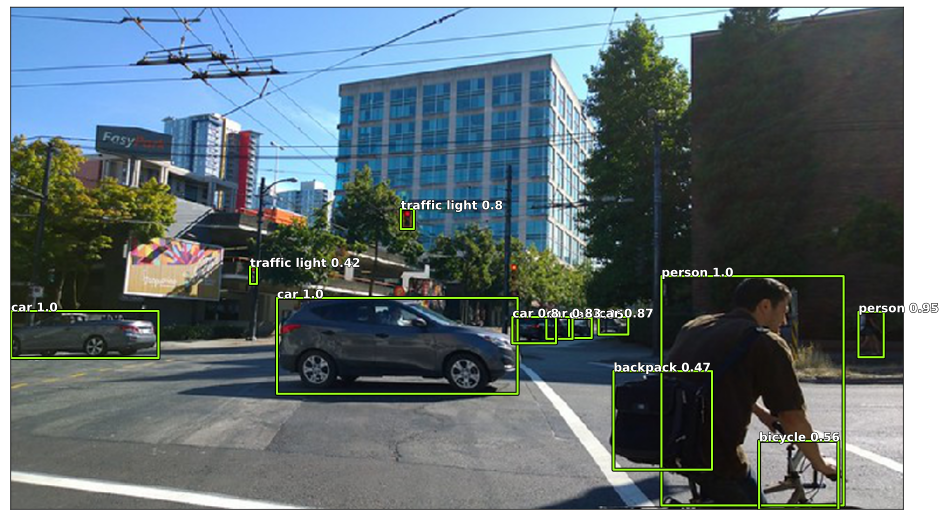

.. code:: ipython3

    import sys
    if '..' not in sys.path:
        sys.path.append('..')

.. code:: ipython3

    import tensorflow as tf
    from ultrayolo import datasets, YoloV3
    from ultrayolo.helpers import draw
    from pathlib import Path
    import numpy as np
    
    from matplotlib import patches
    import matplotlib.pyplot as plt

Predict using default Yolo Model
================================

The classes contained in the dataset

.. code:: ipython3

    classes_dict = datasets.load_classes('./coco_classes.txt', True)
    target_shape = (1024, 1024, 3)
    max_objects = 100
    num_classes = len(classes_dict)
    print(f'number of classes {num_classes}')

.. parsed-literal::

    number of classes 80

.. code:: ipython3

    model = YoloV3(target_shape, max_objects,
                   num_classes=num_classes, score_threshold=0.3, iou_threshold=0.5, training=False)

Load the weights
----------------

load default weights from `Yolo <https://pjreddie.com/darknet/yolo/>`__

!wget https://pjreddie.com/media/files/yolov3.weights

.. code:: ipython3

    w_path = Path('./yolov3.weights')
    model.load_weights(w_path)

.. parsed-literal::

    18020 MainThread loading checkpoint from /Users/fumarolaf/git/ultrayolo/notebooks/yolov3.weights
     18022 MainThread version major 0, minor 2, revision 0, seen 32013312

Predict
-------

we predict the objects using an image from the web. You can try with
your.

Download an image
~~~~~~~~~~~~~~~~~

.. code:: ipython3

    img = datasets.open_image('https://c8.staticflickr.com/4/3901/14855908765_8bdda9130b_z.jpg')
    img_pad = datasets.pad_to_fixed_size(img, target_shape)
    img_resized = datasets.resize(img, target_shape)
    #preprocess the image
    x = np.divide(img_pad, 255.)
    x = np.expand_dims(x, 0)
    x.shape

.. parsed-literal::

    (1, 1024, 1024, 3)

Perform the prediction
~~~~~~~~~~~~~~~~~~~~~~

.. code:: ipython3

    boxes, scores, classes, sel = model.predict(x)
    print(f'found {sel[0]} objects')

.. parsed-literal::

    found 12 objects

Uncomment the cells below to see what the model returns

boxes[:,:sel[0],:]

scores

classes

Show the image with the discovered objects
~~~~~~~~~~~~~~~~~~~~~~~~~~~~~~~~~~~~~~~~~~

.. code:: ipython3

    ax = draw.show_img(img_resized, figsize=(16,10))
    for i,b in enumerate(boxes[0,:sel[0]]):
        draw.rect(ax, b, color='#9cff1d')
        name_score = f'{classes_dict[classes[0, i]]} {str(round(scores[0,i],2))}'
        draw.text(ax, b[:2], name_score, sz=12)
        #print(classes_dict[classes[0, i]], scores[0,i])
        
    plt.show()

