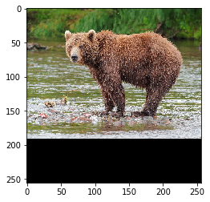
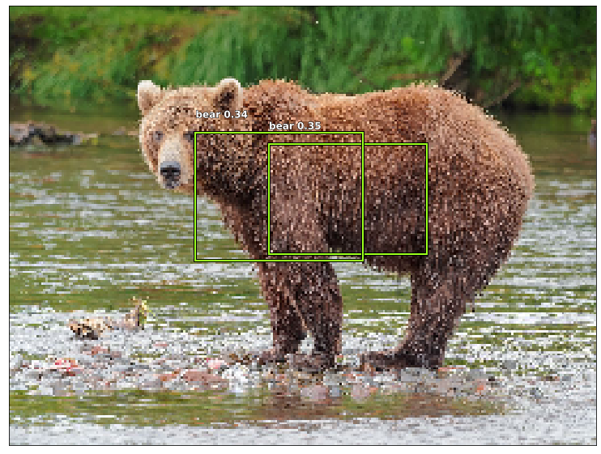

.. code:: ipython3

    import sys
    if '..' not in sys.path:
        sys.path.append('..')

.. code:: ipython3

    %load_ext autoreload
    %autoreload 2

.. code:: ipython3

    import tensorflow as tf
    from ultrayolo import YoloV3, datasets
    from ultrayolo.helpers import draw
    from pathlib import Path
    import numpy as np
    import logging
    
    from matplotlib import patches
    import matplotlib.pyplot as plt

Predict using a custom Model
============================

The classes contained in the dataset

.. code:: ipython3

    classes_dict = datasets.load_classes('../coco_dataset/checkpoints/run_20200204_12:51.30/classes.txt', True)
    target_shape = (256, 256, 3)
    max_objects = 50
    num_classes = len(classes_dict)
    print(f'number of classes {num_classes}')
    classes_dict

.. parsed-literal::

    number of classes 3

.. parsed-literal::

    {0: 'bear', 1: 'toaster', 2: 'hair drier'}

.. code:: ipython3

    anchors = datasets.load_anchors('../coco_dataset/checkpoints/run_20200204_12:51.30/anchors.txt')
    anchors

.. parsed-literal::

    array([[ 10,  13],
           [ 16,  30],
           [ 33,  23],
           [ 30,  61],
           [ 62,  45],
           [ 59, 119],
           [116,  90],
           [156, 198],
           [373, 326]], dtype=int32)

.. code:: ipython3

    model = YoloV3(target_shape, max_objects, anchors=anchors,
                   num_classes=num_classes, score_threshold=0.3, iou_threshold=0.7, 
                   training=False, backbone='MobileNetV2')

tf.keras.utils.plot_model(model.model, show_shapes=True)

Load the weights
----------------

load a custom model from `here <add%20a%20valid%20link%20here>`__

.. code:: ipython3

    w_path = Path('../coco_dataset/checkpoints/run_20200204_12:51.30/weights.002-157.428.h5')
    # w_path = Path('./weights.h5')
    model.load_weights(w_path)

.. parsed-literal::

      9187 MainThread loading checkpoint from /Users/fumarolaf/git/ultrayolo/notebooks/../coco_dataset/checkpoints/run_20200204_12:51.30/weights.002-157.428.h5

Predict
-------

we predict the objects using an image from the web. You can try with
your.

Download an image
~~~~~~~~~~~~~~~~~

.. code:: ipython3

    img = datasets.open_image('https://upload.wikimedia.org/wikipedia/commons/thumb/5/5d/Kamchatka_Brown_Bear_near_Dvuhyurtochnoe_on_2015-07-23.jpg/1200px-Kamchatka_Brown_Bear_near_Dvuhyurtochnoe_on_2015-07-23.jpg')
    # img = datasets.open_image('https://lh6.googleusercontent.com/proxy/Jo961aR6HemjY-D0TKiVEkVlI7b84uTkfJHSFBCz4UN2maJidjYVznbPrxDpRDd6wlbqn80ZmP_ohdCPkE9syrVJPIjiYvgbo9ovRAArlFC_9Sm4V3NZi--R')
    img_pad = datasets.pad_to_fixed_size(img, target_shape)
    img_resized = datasets.resize(img, target_shape)
    #preprocess the image
    x = np.divide(img_pad, 255.)
    x = np.expand_dims(x, 0)
    x.shape

.. parsed-literal::

    (1, 256, 256, 3)

.. code:: ipython3

    plt.imshow(x[0])

.. parsed-literal::

    <matplotlib.image.AxesImage at 0x15d3c5250>

Perform the prediction
~~~~~~~~~~~~~~~~~~~~~~

.. code:: ipython3

    boxes, scores, classes, sel = model.predict(x)
    print(f'found {sel[0]} objects')

.. parsed-literal::

    found 2 objects

Uncomment the cells below to see what the model returns

boxes[:,:sel[0],:]

scores

classes

Show the image with the discovered objects
~~~~~~~~~~~~~~~~~~~~~~~~~~~~~~~~~~~~~~~~~~

.. code:: ipython3

    ax = draw.show_img(img_resized, figsize=(16,10))
    for i,b in enumerate(boxes[0,:sel[0]]):
        draw.rect(ax, b, color='#9cff1d')
        name_score = f'{classes_dict[classes[0, i]]} {str(round(scores[0,i],2))}'
        draw.text(ax, b[:2], name_score, sz=12)
        print(classes_dict[classes[0, i]], scores[0,i])
        
    plt.show()

.. parsed-literal::

    bear 0.35302937
    bear 0.34380215

