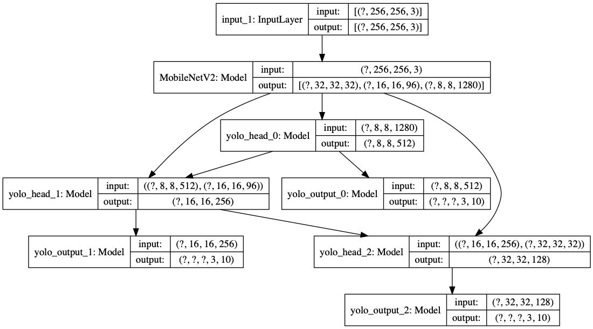
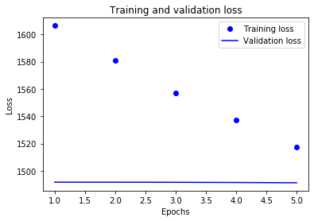
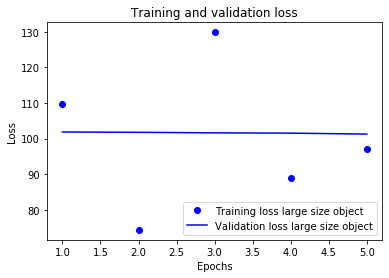
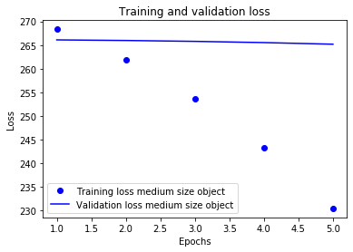
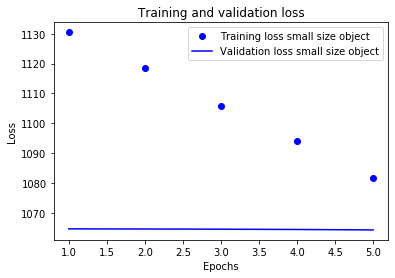

.. code:: ipython3

    import sys
    # add the code path
    sys.path.append('..')

.. code:: ipython3

    %load_ext autoreload
    %autoreload 2

Sample to train Yolo for object detection
-----------------------------------------

.. code:: ipython3

    from ultrayolo import YoloV3, callbacks
    from ultrayolo import datasets
    from pathlib import Path
    import tensorflow as tf
    from ultrayolo import losses
    import matplotlib.pyplot as plt

Define the parameters for the run

.. code:: ipython3

    image_shape = (256,256,3)
    batch_shape = 4
    max_objects = 100
    train_dataset_path = '../tests/data/manifest.txt'
    anchors = datasets.load_anchors('../tests/data/yolov3_anchors.txt')
    classes = datasets.load_classes('../tests/data/classes.txt')

Create the model

.. code:: ipython3

    model = YoloV3(image_shape, max_objects, 
                   anchors=anchors, num_classes=len(classes), 
                   training=True, backbone='ResNet50V2')

.. code:: ipython3

    tf.keras.utils.plot_model(model.model, show_shapes=True)

Make optimizer and loss

.. code:: ipython3

    optimizer = model.get_optimizer('adam', 1e-4)
    model_loss = model.get_loss_function()

.. parsed-literal::

     24588 MainThread using adam optimize

.. code:: ipython3

    model_loss

.. parsed-literal::

    [yolo_loss0 at 0x15d7d0490,
     yolo_loss1 at 0x157e41a90,
     yolo_loss2 at 0x157e41e10]

compile the model

.. code:: ipython3

    model.compile(optimizer, model_loss, run_eagerly=True, summary=False)

Create the dataset

.. code:: ipython3

    train_dataset = datasets.YoloDatasetMultiFile(
        train_dataset_path, image_shape, max_objects, batch_shape, 
        model.anchors, model.masks, len(classes)
    )

.. code:: ipython3

    print('num batches', len(train_dataset))

.. parsed-literal::

    num batches 1

Create the callbacks

.. code:: ipython3

    model_callbacks = callbacks.default_callbacks(model,
        run_path='./checkpoints', lrate_mode='exp_range',
        lrate_value=1e-4, verbose=0)

Set the model in transfer mode

.. code:: ipython3

    model.set_mode_transfer()

.. parsed-literal::

     37651 MainThread freeze backbone

.. code:: ipython3

    history = model.fit(train_dataset, train_dataset, 5, callbacks=model_callbacks)

.. parsed-literal::

     38059 MainThread training for 5 epochs on the dataset /Users/fumarolaf/git/tfyolo3/notebooks/../tests/data

.. parsed-literal::

    Train for 1 steps, validate for 1 steps
    Epoch 1/5
    1/1 [==============================] - 9s 9s/step - loss: 1503.2344 - yolo_output_0_loss: 109.7905 - yolo_output_1_loss: 268.3429 - yolo_output_2_loss: 1037.7290 - val_loss: 1519.8442 - val_yolo_output_0_loss: 101.8549 - val_yolo_output_1_loss: 266.0881 - val_yolo_output_2_loss: 1064.5364
    Epoch 2/5
    1/1 [==============================] - 7s 7s/step - loss: 1446.4153 - yolo_output_0_loss: 74.3568 - yolo_output_1_loss: 261.9007 - yolo_output_2_loss: 1022.7929 - val_loss: 1519.3585 - val_yolo_output_0_loss: 101.7645 - val_yolo_output_1_loss: 265.9644 - val_yolo_output_2_loss: 1064.2737
    Epoch 3/5
    1/1 [==============================] - 5s 5s/step - loss: 1475.4344 - yolo_output_0_loss: 129.8671 - yolo_output_1_loss: 253.6545 - yolo_output_2_loss: 1004.5569 - val_loss: 1518.6138 - val_yolo_output_0_loss: 101.6138 - val_yolo_output_1_loss: 265.7768 - val_yolo_output_2_loss: 1063.8726
    Epoch 4/5
    1/1 [==============================] - 7s 7s/step - loss: 1403.5203 - yolo_output_0_loss: 88.9308 - yolo_output_1_loss: 243.3614 - yolo_output_2_loss: 983.8774 - val_loss: 1517.7263 - val_yolo_output_0_loss: 101.5380 - val_yolo_output_1_loss: 265.5177 - val_yolo_output_2_loss: 1063.3215
    Epoch 5/5
    1/1 [==============================] - 6s 6s/step - loss: 1373.8488 - yolo_output_0_loss: 97.0849 - yolo_output_1_loss: 230.4656 - yolo_output_2_loss: 958.9492 - val_loss: 1516.3846 - val_yolo_output_0_loss: 101.2649 - val_yolo_output_1_loss: 265.1777 - val_yolo_output_2_loss: 1062.5885

Evaluate model Loss
-------------------

.. code:: ipython3

    loss = history.history['loss']
    val_loss = history.history['val_loss']
    
    epochs = range(1, len(loss) + 1)
    
    # "bo" is for "blue dot"
    plt.plot(epochs, loss, 'bo', label='Training loss')
    # b is for "solid blue line"
    plt.plot(epochs, val_loss, 'b', label='Validation loss')
    plt.title('Training and validation loss')
    plt.xlabel('Epochs')
    plt.ylabel('Loss')
    plt.legend()
    
    plt.show()

Yolo loss for large-sized objects
~~~~~~~~~~~~~~~~~~~~~~~~~~~~~~~~~

.. code:: ipython3

    loss = history.history['yolo_output_0_loss']
    val_loss = history.history['val_yolo_output_0_loss']
    
    epochs = range(1, len(loss) + 1)
    
    # "bo" is for "blue dot"
    plt.plot(epochs, loss, 'bo', label='Training loss large size object')
    # b is for "solid blue line"
    plt.plot(epochs, val_loss, 'b', label='Validation loss large size object')
    plt.title('Training and validation loss')
    plt.xlabel('Epochs')
    plt.ylabel('Loss')
    plt.legend()
    
    plt.show()

Yolo loss for medium-sized objects
~~~~~~~~~~~~~~~~~~~~~~~~~~~~~~~~~~

.. code:: ipython3

    loss = history.history['yolo_output_1_loss']
    val_loss = history.history['val_yolo_output_1_loss']
    
    epochs = range(1, len(loss) + 1)
    
    # "bo" is for "blue dot"
    plt.plot(epochs, loss, 'bo', label='Training loss medium size object')
    # b is for "solid blue line"
    plt.plot(epochs, val_loss, 'b', label='Validation loss medium size object')
    plt.title('Training and validation loss')
    plt.xlabel('Epochs')
    plt.ylabel('Loss')
    plt.legend()
    
    plt.show()

Yolo loss for small-sized objects
~~~~~~~~~~~~~~~~~~~~~~~~~~~~~~~~~

.. code:: ipython3

    loss = history.history['yolo_output_2_loss']
    val_loss = history.history['val_yolo_output_2_loss']
    
    epochs = range(1, len(loss) + 1)
    
    # "bo" is for "blue dot"
    plt.plot(epochs, loss, 'bo', label='Training loss small size object')
    # b is for "solid blue line"
    plt.plot(epochs, val_loss, 'b', label='Validation loss small size object')
    plt.title('Training and validation loss')
    plt.xlabel('Epochs')
    plt.ylabel('Loss')
    plt.legend()
    
    plt.show()

model.save('./save_model/model.h5')
