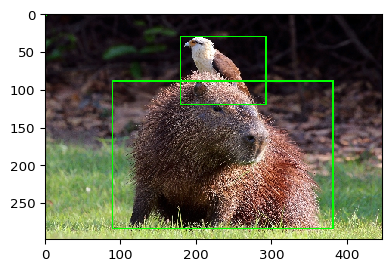
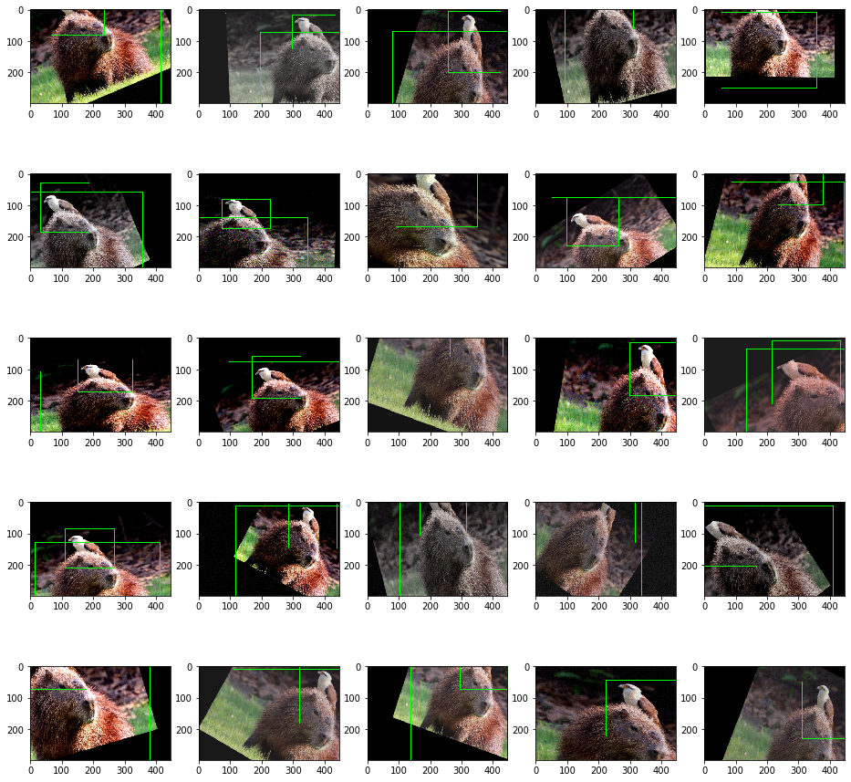
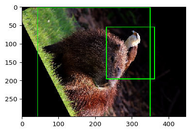

.. code:: ipython3

    import imageio
    import imgaug as ia
    from imgaug import augmenters as iaa
    from imgaug.augmentables.bbs import BoundingBox, BoundingBoxesOnImage
    from imgaug.augmentables.batches import Batch
    import numpy as np
    import matplotlib.pyplot as plt

Data Augmentation
-----------------

In order to make the model not overfit on the dataset we need to apply
data augmentations techniques. By default extrayolo supports
`imgaug <>`__ as data augmentation framework. The example below shows an
example of image with 2 bounding boxes.

.. code:: ipython3

    image = imageio.imread("https://upload.wikimedia.org/wikipedia/commons/8/8e/Yellow-headed_caracara_%28Milvago_chimachima%29_on_capybara_%28Hydrochoeris_hydrochaeris%29.JPG")
    image = ia.imresize_single_image(image, (298, 447))
    
    bbs = BoundingBoxesOnImage([
        BoundingBox(x1=0.2*447, x2=0.85*447, y1=0.3*298, y2=0.95*298),
        BoundingBox(x1=0.4*447, x2=0.65*447, y1=0.1*298, y2=0.4*298),
        BoundingBox(0,0,0,0)
    ], shape=image.shape)
    
    ia.imshow(bbs.draw_on_image(image, size=2))

In order to perform data augmentation on the image we can create a
pipeline of transformations.

.. code:: ipython3

    pipeline = iaa.Sequential([
        iaa.Crop(percent=(0, 0.2)), # random crops
        # Small gaussian blur with random sigma between 0 and 0.5.
        # But we only blur about 50% of all images.
        iaa.Sometimes(
            0.5,
            iaa.GaussianBlur(sigma=(0, 0.5))
        ),
        iaa.Sometimes(
            0.2,
            iaa.Grayscale(alpha=(0.0, 1.0))
        ),
        # Strengthen or weaken the contrast in each image.
        iaa.LinearContrast((0.75, 1.5)),
        # Add gaussian noise.
        # For 50% of all images, we sample the noise once per pixel.
        # For the other 50% of all images, we sample the noise per pixel AND
        # channel. This can change the color (not only brightness) of the
        # pixels.
        iaa.AdditiveGaussianNoise(loc=0, scale=(0.0, 0.05*255), per_channel=0.5),
        # Make some images brighter and some darker.
        # In 20% of all cases, we sample the multiplier once per channel,
        # which can end up changing the color of the images.
        iaa.Multiply((0.8, 1.2), per_channel=0.2),
        # Apply affine transformations to each image.
        # Scale/zoom them, translate/move them, rotate them and shear them.
        iaa.Affine(
            scale={"x": (0.8, 1.5), "y": (0.8, 1.5)},
            translate_percent={"x": (-0.3, 0.3), "y": (-0.3, 0.3)},
            rotate=(-30, 30),
            shear=(-12, 12)
        ),
    ], random_order=True)

.. code:: ipython3

    fig, axes = plt.subplots(5,5, figsize=(16,16))
    axes = axes.flatten()
    
    for ax in axes:
        image_aug, bbs_aug = pipeline(image=image, bounding_boxes=bbs)
    #     print(np.count_nonzero(image_aug < 0))
        ax.imshow(bbs_aug.draw_on_image(np.clip(image_aug,0, None), size=2))
        bbs_aug.to_xyxy_array()
    
    plt.show()

We can see that the images is augmented such as the boxes. Given a set
of transformations they can be applied to a batch of images. We create a
batch of images

.. code:: ipython3

    images = np.array([image, image])
    bbss = [bbs, bbs]
    batch = Batch(images=images, bounding_boxes=bbss)

.. code:: ipython3

    pipeline = iaa.Sequential([
        iaa.GammaContrast(1.5),
        iaa.Affine(rotate=(-90, 90))
    ])

and perform data augmentation on the batch

.. code:: ipython3

    batch_processed = pipeline.augment_batch(batch)
    batch_processed.images_aug.shape

.. parsed-literal::

    /Users/fumarolaf/miniconda3/envs/dl/lib/python3.7/site-packages/imgaug/imgaug.py:184: DeprecationWarning: Method `Sequential.augment_batch()` is deprecated. Use `augment_batch_()` instead. `augment_batch()` was renamed to `augment_batch_()` as it changes all `*_unaug` attributes of batches in-place. Note that `augment_batch_()` has now a `parents` parameter. Calls of the style `augment_batch(batch, hooks)` must be changed to `augment_batch(batch, hooks=hooks)`.
      warn_deprecated(msg, stacklevel=3)

.. parsed-literal::

    (2, 298, 447, 3)

.. code:: ipython3

    for image_aug, bbs_aug in zip(batch_processed.images_aug, batch_processed.bounding_boxes_aug):
        ia.imshow(bbs_aug.draw_on_image(image_aug, size=2))
        print(bbs_aug.to_xyxy_array())

.. parsed-literal::

    [[  42.94179      2.4848936  348.00412    349.43832  ]
     [ 229.58095     54.77084    360.16602    195.02307  ]
     [ 253.90475   -117.887245   253.90475   -117.887245 ]]

.. image:: 5_data_augmentation_considerations_files/5_data_augmentation_considerations_11_2.png

.. parsed-literal::

    [[ 45.978065  39.323105 390.5972   335.75543 ]
     [195.1043    21.98099  333.80573  149.56241 ]
     [ 81.52142  -79.02486   81.52142  -79.02486 ]]

