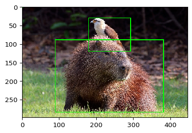
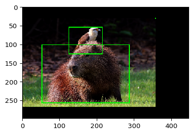
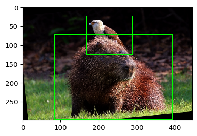

.. code:: ipython3

    import imageio
    import imgaug as ia
    from imgaug import augmenters as iaa
    from imgaug.augmentables.bbs import BoundingBox, BoundingBoxesOnImage
    from imgaug.augmentables.batches import Batch
    import numpy as np
    import matplotlib.pyplot as plt

Data Augmentation
-----------------

In order to make the model not overfit on the dataset we need to apply
data augmentations techniques. By default extrayolo supports
`imgaug <>`__ as data augmentation framework. The example below shows an
example of image with 2 bounding boxes.

.. code:: ipython3

    image = imageio.imread("https://upload.wikimedia.org/wikipedia/commons/8/8e/Yellow-headed_caracara_%28Milvago_chimachima%29_on_capybara_%28Hydrochoeris_hydrochaeris%29.JPG")
    image = ia.imresize_single_image(image, (298, 447))
    
    bbs = BoundingBoxesOnImage([
        BoundingBox(x1=0.2*447, x2=0.85*447, y1=0.3*298, y2=0.95*298),
        BoundingBox(x1=0.4*447, x2=0.65*447, y1=0.1*298, y2=0.4*298),
        BoundingBox(0,0,0,0)
    ], shape=image.shape)
    
    ia.imshow(bbs.draw_on_image(image, size=2))

In order to perform data augmentation on the image we can create a
pipeline of transformations.

.. code:: ipython3

    pipeline = iaa.Sequential([
        iaa.GammaContrast(1.5), # add contrast
        iaa.Affine(translate_percent={"x": 0.1}, scale=0.8), # translate the image
        iaa.Fliplr(p = 1.0) # apply horizontal flip
    ])

.. code:: ipython3

    image_aug, bbs_aug = pipeline(image=image, bounding_boxes=bbs)
    ia.imshow(bbs_aug.draw_on_image(image_aug, size=2))
    bbs_aug.to_xyxy_array()

.. parsed-literal::

    array([[ 53.439987, 101.22    , 285.88    , 256.18    ],
           [124.96001 ,  53.539997, 214.36    , 125.06    ],
           [357.4     ,  29.699999, 357.4     ,  29.699999]], dtype=float32)

We can see that the images is augmented such as the boxes. Given a set
of transformations they can be applied to a batch of images. We create a
batch of images

.. code:: ipython3

    images = np.array([image, image])
    bbss = [bbs, bbs]
    batch = Batch(images=images, bounding_boxes=bbss)

.. code:: ipython3

    pipeline = iaa.Sequential([
        iaa.GammaContrast(1.5),
        iaa.Affine(rotate=(-90, 90))
    ])

and perform data augmentation on the batch

.. code:: ipython3

    batch_processed = pipeline.augment_batch(batch)
    batch_processed.images_aug.shape

.. parsed-literal::

    (2, 298, 447, 3)

.. code:: ipython3

    for image_aug, bbs_aug in zip(batch_processed.images_aug, batch_processed.bounding_boxes_aug):
        ia.imshow(bbs_aug.draw_on_image(image_aug, size=2))
        print(bbs_aug.to_xyxy_array())

.. image:: 5_data_augmentation_howto_files/5_data_augmentation_howto_11_0.png

.. parsed-literal::

    [[ 84.47671     -0.95089597 429.66367    337.98044   ]
     [110.338524    15.286891   253.14641    156.65118   ]
     [-41.822052   189.12672    -41.822052   189.12672   ]]

.. parsed-literal::

    [[ 83.97693   73.39386  393.1003   296.26755 ]
     [166.692     23.417078 287.13556  123.95688 ]
     [-14.237909  24.003315 -14.237909  24.003315]]

.. code:: ipython3

    def make_augmentations(max_number_augs=5):
        augmentation = iaa.SomeOf((0, max_number_augs), [
            iaa.GaussianBlur(sigma=(0.0, 3.0)),
            iaa.Affine(scale=(1., 2.5), rotate=(-90, 90), shear=(-16, 16),
                       translate_percent={"x": (-0.2, 0.2), "y": (-0.2, 0.2)}),
            iaa.LinearContrast((0.5, 1.5)),
            iaa.AdditiveGaussianNoise(scale=(0, 0.05 * 255)),
            iaa.Alpha((0.0, 1.0), iaa.Grayscale(1.0)),
            iaa.LogContrast(gain=(0.6, 1.4)),
            iaa.PerspectiveTransform(scale=(0.01, 0.15)),
            iaa.Clouds(),
            iaa.Alpha(
                (0.0, 1.0),
                first=iaa.Add(100),
                second=iaa.Multiply(0.2)),
            iaa.MotionBlur(k=5),
            iaa.MultiplyHueAndSaturation((0.5, 1.0), per_channel=True),
            iaa.AddToSaturation((-50, 50)),
            iaa.Noop()
        ])
        return augmentation
