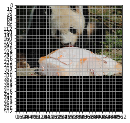

.. code:: ipython3

    %load_ext autoreload
    %autoreload 2

.. code:: ipython3

    import sys
    if '..' not in sys.path:
        sys.path.append('..')
    
    from ultrayolo import YoloV3, losses
    from ultrayolo.datasets import CocoFormatDataset, common
    from ultrayolo.helpers import draw
    from pathlib import Path
    import numpy as np
    import tensorflow as tf
    import matplotlib.pyplot as plt

Yolo Loss Tutorial
==================

The first create some random anchors and use the default masks

.. code:: ipython3

    x = np.arange(5, 46, 5)
    anchors = np.array(list(zip(x,x)), dtype=np.float32)
    anchors[:,1] += np.random.randint(0, 10, 9)
    anchors

.. parsed-literal::

    array([[ 5.,  7.],
           [10., 12.],
           [15., 15.],
           [20., 24.],
           [25., 34.],
           [30., 30.],
           [35., 36.],
           [40., 45.],
           [45., 50.]], dtype=float32)

.. code:: ipython3

    masks = YoloV3.default_masks
    masks

.. parsed-literal::

    array([[6, 7, 8],
           [3, 4, 5],
           [0, 1, 2]])

And load the dataset using the SequenceDataset
----------------------------------------------

.. code:: ipython3

    filepath = Path('./toy_dataset/data_annotations_train.txt')
    target_shape = (512, 512, 3)
    batch_size = 2
    is_training = True
    max_objects = 10
    
    
    train_seq = CocoFormatDataset('../minicoco_dataset/hair_drier_toaster_bear.json',
                                      target_shape,
                                      max_objects,
                                      batch_size, 
                                      anchors,
                                      masks,
                                      is_training=is_training)

.. parsed-literal::

    load coco annotations: 100%|██████████| 1714/1714 [00:00<00:00, 852690.91it/s]

.. code:: ipython3

    train_seq.classes

.. parsed-literal::

    [(23, 'bear'), (80, 'toaster'), (89, 'hair drier')]

Now we take a batch from the dataset
------------------------------------

.. code:: ipython3

    x_true, y_true_grids = train_seq[0]

The batch contains: - 2 images

.. code:: ipython3

    x_true.shape

.. parsed-literal::

    (2, 512, 512, 3)

-  3 grids

.. code:: ipython3

    for i in range(len(y_true_grids)): 
        print(i, '-->', y_true_grids[i].shape, target_shape[0] / y_true_grids[i].shape[1])

.. parsed-literal::

    0 --> (2, 16, 16, 3, 8) 32.0
    1 --> (2, 32, 32, 3, 8) 16.0
    2 --> (2, 64, 64, 3, 8) 8.0

The third value plotted represents the size in number of pixel of grid
cells

Check that the dataset transformed is correct
---------------------------------------------

.. code:: ipython3

    for img_idx in range(len(x_true)):
        print('Show annotations for image', img_idx)
        img = x_true[img_idx]
    
        for i in range(len(y_true_grids)):
            y_data_grid_img = y_true_grids[i][img_idx]
            
            ax = draw.show_img(img)
            grid_len = y_data_grid_img.shape[1]
            draw.grid(ax, img.shape[:2], grid_len)
    
            grid_cell_size = target_shape[1] / grid_len
            
            for grid_y, grid_x, box in np.argwhere(np.sum(y_data_grid_img[..., :4], axis=-1) > 0):
                box_xyxy = (y_data_grid_img[grid_y,grid_x,box, :4] * target_shape[0]).astype(int)
                class_id = np.argwhere(y_data_grid_img[grid_y,grid_x,box, 5:])[0][0]
                draw.rect(ax, box_xyxy, 'white', 1)
                print(y_data_grid_img[grid_y,grid_x,box, :4])
                print(box_xyxy)
    
                rect_resp = np.array([grid_x, grid_y]) * grid_cell_size
                rect_resp = np.concatenate([rect_resp, rect_resp + grid_cell_size])
                draw.rect(ax, rect_resp, 'blue', 2)
    
                draw.point(ax, common.to_center_width_height(box_xyxy)[:2])
            plt.show()

.. parsed-literal::

    Show annotations for image 0
    [0.         0.00375439 0.8535156  0.587484  ]
    [  0   1 437 300]

.. image:: 3_check_yolo_loss_files/3_check_yolo_loss_16_1.png

.. image:: 3_check_yolo_loss_files/3_check_yolo_loss_16_3.png

.. parsed-literal::

    Show annotations for image 1
    [0.44003123 0.464507   0.48345312 0.5184867 ]
    [225 237 247 265]

.. image:: 3_check_yolo_loss_files/3_check_yolo_loss_16_5.png

.. image:: 3_check_yolo_loss_files/3_check_yolo_loss_16_6.png

.. image:: 3_check_yolo_loss_files/3_check_yolo_loss_16_7.png

Create the model

.. code:: ipython3

    model = YoloV3(target_shape, max_objects, 
                   anchors=anchors, num_classes=train_seq.num_classes, 
                   training=True, backbone='DarkNet')

tf.keras.utils.plot_model(model.model, show_shapes=True)

Evaluate how the loss works
---------------------------

We consider two cases:

1. when we got an initialized network the predictions should be around
   0.5 (max entropy)
2. when we give as prediction the right labels the loss should be close
   to zero

.. code:: ipython3

    y_pred_grids = model(x_true)
    for y_pred in y_pred_grids:
        print(y_pred.shape)

.. parsed-literal::

    (2, 16, 16, 3, 8)
    (2, 32, 32, 3, 8)
    (2, 64, 64, 3, 8)

We take i=0 since all the images are in the first grid

.. code:: ipython3

    i = 0
    y_true = y_true_grids[i]
    y_pred = y_pred_grids[i]
    y_pred = tf.slice(y_pred, begin=[0,0,0,0,0], size=y_true.shape)
    anchors_masks = anchors[masks[i]]
    img_size = target_shape[0]
    loss_fn = losses.make_loss(train_seq.num_classes, anchors, masks, img_size, len(train_seq))
    ignore_threshold = 0.7

First Case
~~~~~~~~~~

.. code:: ipython3

    from ultrayolo.losses import YoloLoss

.. code:: ipython3

    def to_box_xyxy(box_xy, box_wh, grid_size, anchors_masks):
        """convert the given boxes into the xy_min xy_max format
        Arguments:
            box_xy {tf.tensor} --
            box_wh {tf,tensor} --
            grid_size {float} -- the size of the grid used
            anchors_masks {tf.tensor} -- the anchor masks
        Returns:
            tf.tensor -- the boxes
        """
        # !!! grid[x][y] == (y, x)
        grid = tf.meshgrid(tf.range(grid_size), tf.range(grid_size))
        grid = tf.expand_dims(tf.stack(grid, axis=-1), axis=2)    # [gx, gy, 1, 2]
        grid = tf.cast(grid, tf.float32)
    
        box_xy = (box_xy + grid) / tf.cast(grid_size, tf.float32)
        box_wh = tf.exp(box_wh) * anchors_masks
    
        box_wh = tf.where(tf.math.is_inf(box_wh), tf.zeros_like(box_wh), box_wh)
    
        box_x1y1 = box_xy - box_wh / 2
        box_x2y2 = box_xy + box_wh / 2
        box_xyxy = tf.concat([box_x1y1, box_x2y2], axis=-1)
    
        return box_xyxy
    
    def process_predictions(y_pred, num_classes, anchors_masks):
        """process the predictions to transform from:
        -  pred_xy, pred_wh, pred_obj, pred_class
        into
        - box_xyxy, pred_obj, pred_class, pred_xywh
    
        Arguments:
            y_pred {tf.tensor} -- the predictions in the format 
                (NBATCH, x_center, y_center, width, heigth, obj, one_hot_classes)
            num_classes {int} -- the number of classes
            anchors_masks {tf.tensor} -- the anchors masks
    
        Returns:
            tuple -- box_xyxy, pred_obj, pred_class, pred_xywh
        """
        # anchors_masks = tf.gather(anchors, masks)
    
        pred_xy, pred_wh, pred_obj, pred_class = tf.split(y_pred,
                                                          (2, 2, 1, num_classes),
                                                          axis=-1)
    
        pred_xy = tf.sigmoid(pred_xy)
        pred_obj = tf.sigmoid(pred_obj)
        pred_class = tf.sigmoid(pred_class)
        pred_xywh = tf.concat((pred_xy, pred_wh), axis=-1)
    
        grid_size = tf.shape(y_pred)[1]
        box_xyxy = to_box_xyxy(pred_xy, pred_wh, grid_size, anchors_masks)
    
        return box_xyxy, pred_obj, pred_class, pred_xywh

.. code:: ipython3

    # 1. transform all pred outputs
    # y_pred: (batch_size, grid, grid, anchors, (x, y, w, h, obj, ...cls))
    anchors_masks_scaled = anchors_masks / img_size
    pred_xyxy, pred_obj, pred_class, pred_xywh = process_predictions(
                tf.cast(y_pred, tf.float32), train_seq.num_classes, anchors_masks_scaled
    )
    pred_xy = pred_xywh[..., 0:2]
    pred_wh = pred_xywh[..., 2:4]

We expect that considering the variable ``pred_xywh`` the predictions
should be: - for xy in in average 0.5 - for wh close to 0 - for xy1, xy2
close to 0.5

While considering ``pred_xyxy`` it should be around 0.5

.. code:: ipython3

    print('average xy', tf.reduce_mean(pred_xy))
    print('average hw', tf.reduce_mean(pred_wh))
    print('average xyxy', tf.reduce_mean(pred_xyxy))

.. parsed-literal::

    average xy tf.Tensor(0.5, shape=(), dtype=float32)
    average hw tf.Tensor(1.2739657e-09, shape=(), dtype=float32)
    average xyxy tf.Tensor(0.5, shape=(), dtype=float32)

This is valid for all the objecteness and classes

.. code:: ipython3

    print('average pred_obj', tf.reduce_mean(pred_obj))
    print('average pred_class', tf.reduce_mean(pred_class))

.. parsed-literal::

    average pred_obj tf.Tensor(0.5, shape=(), dtype=float32)
    average pred_class tf.Tensor(0.5, shape=(), dtype=float32)

.. code:: ipython3

    # 2. transform all true outputs
    # y_true: (batch_size, grid, grid, anchors, (x, y, w, h, obj, ...cls))
    true_box_xyxy, true_obj, true_class = tf.split(
        y_true, (4, 1, train_seq.num_classes), axis=-1)
    true_xy = (true_box_xyxy[..., 0:2] + true_box_xyxy[..., 2:4]) / 2
    true_wh = true_box_xyxy[..., 2:4] - true_box_xyxy[..., 0:2]

.. code:: ipython3

    box_loss_scale = 2 - true_wh[..., 0] * true_wh[..., 1]

3. inverting the pred box equations, to make it comparable with the
   transformations done for the predictions

.. code:: ipython3

    grid_size = tf.shape(y_true)[1]
    grid = tf.meshgrid(tf.range(grid_size), tf.range(grid_size))
    grid = tf.expand_dims(tf.stack(grid, axis=-1), axis=2)
    true_xy = true_xy * tf.cast(grid_size, tf.float32) - \
        tf.cast(grid, tf.float32)
    
    true_wh = tf.math.log(true_wh / anchors_masks_scaled)
    true_wh = tf.where(tf.math.is_inf(true_wh),
                       tf.zeros_like(true_wh), true_wh)

The line 8 contains the opposite transformation made for the predictions

::

   box_wh = tf.exp(box_wh) * anchors_masks

The masks are used to: 1. separate the boxes that contain objects and
should be considered in the objects loss 2. from the boxes that not
contain objects and should be considered in the **no object loss**

.. code:: ipython3

    # 4. calculate all masks
    obj_mask = tf.squeeze(true_obj, -1)
    # ignore false positive when iou is over threshold
    true_box_mask = tf.boolean_mask(
        true_box_xyxy, tf.cast(obj_mask, tf.bool))
    best_iou = tf.reduce_max(YoloLoss.broadcast_iou(
        pred_xyxy, true_box_mask), axis=-1)
    ignore_mask = tf.cast(best_iou < ignore_threshold, tf.float32)

Compute all the losses

-  xy, wh only with respect the objects that contains elements

.. code:: ipython3

    xy_loss = obj_mask * box_loss_scale * \
        tf.reduce_sum(tf.square(true_xy - pred_xy), axis=-1)
    wh_loss = obj_mask * box_loss_scale * \
        tf.reduce_sum(tf.square(true_wh - pred_wh), axis=-1)

-  the object and no object loss

You can check the whenever the loss is different to zero in the
``obj_loss`` is zero in the ``no_obj_loss`` and vice-versa

.. code:: ipython3

    obj_cross_entropy = tf.keras.metrics.binary_crossentropy(
        true_obj, pred_obj, from_logits=False)
    obj_loss = obj_mask * obj_cross_entropy
    no_obj_loss = (1 - obj_mask) * ignore_mask * obj_cross_entropy

-  The class loss is computed only for the cells the contains objects

.. code:: ipython3

    class_loss = obj_mask * tf.keras.metrics.binary_crossentropy(
                true_class, pred_class, from_logits=False)

-  everything is reduced to one value per image

.. code:: ipython3

    xy_loss = tf.reduce_sum(xy_loss, axis=(1, 2, 3))
    wh_loss = tf.reduce_sum(wh_loss, axis=(1, 2, 3))
    obj_loss = tf.reduce_sum(obj_loss, axis=(1, 2, 3))
    no_obj_loss = tf.reduce_sum(no_obj_loss, axis=(1, 2, 3))
    class_loss = tf.reduce_sum(class_loss, axis=(1, 2, 3))
    
    loss = xy_loss + wh_loss + obj_loss + no_obj_loss + class_loss
    
    loss

.. parsed-literal::

    <tf.Tensor: shape=(2,), dtype=float32, numpy=array([545.8325, 535.0147], dtype=float32)>

Second Case
~~~~~~~~~~~

-  y_true == y_pred

.. code:: ipython3

    i = 0
    y_true = y_true_grids[i]
    y_pred = y_true

-  Remember that y_pred is in format xy_min xy_max

.. code:: ipython3

    pred_xyxy, pred_obj, pred_class = tf.split(
            y_pred, (4, 1, train_seq.num_classes), axis=-1)
    
    pred_xy = (pred_xyxy[..., 0:2] + pred_xyxy[..., 2:4]) / 2
    pred_wh = pred_xyxy[..., 2:4] - pred_xyxy[..., 0:2]
    
    pred_xywh = tf.concat((pred_xy, pred_wh), axis=-1)

.. code:: ipython3

    true_box_xyxy, true_obj, true_class = tf.split(
                y_true, (4, 1, train_seq.num_classes), axis=-1)
    true_xy = (true_box_xyxy[..., 0:2] + true_box_xyxy[..., 2:4]) / 2
    true_wh = true_box_xyxy[..., 2:4] - true_box_xyxy[..., 0:2]

.. code:: ipython3

    box_loss_scale = 2 - true_wh[..., 0] * true_wh[..., 1]
    
    # 4. calculate all masks
    obj_mask = tf.squeeze(true_obj, -1)
    # ignore false positive when iou is over threshold
    true_box_mask = tf.boolean_mask(
        true_box_xyxy, tf.cast(obj_mask, tf.bool))
    best_iou = tf.reduce_max(YoloLoss.broadcast_iou(
        pred_xyxy, true_box_mask), axis=-1)
    ignore_mask = tf.cast(best_iou < ignore_threshold, tf.float32)

.. code:: ipython3

    # 5. compute all the losses
    xy_loss = obj_mask * box_loss_scale * \
        tf.reduce_sum(tf.square(true_xy - pred_xy), axis=-1)
    wh_loss = obj_mask * box_loss_scale * \
        tf.reduce_sum(tf.square(true_wh - pred_wh), axis=-1)

.. code:: ipython3

    obj_cross_entropy = tf.keras.metrics.binary_crossentropy(
        true_obj, pred_obj, from_logits=False)
    obj_loss = obj_mask * obj_cross_entropy
    no_obj_loss = (1 - obj_mask) * ignore_mask * obj_cross_entropy
    
    class_loss = obj_mask * tf.keras.metrics.binary_crossentropy(
        true_class, pred_class, from_logits=False)

.. code:: ipython3

    xy_loss = tf.reduce_sum(xy_loss, axis=(1, 2, 3))
    wh_loss = tf.reduce_sum(wh_loss, axis=(1, 2, 3))
    obj_loss = tf.reduce_sum(obj_loss, axis=(1, 2, 3))
    no_obj_loss = tf.reduce_sum(no_obj_loss, axis=(1, 2, 3))
    class_loss = tf.reduce_sum(class_loss, axis=(1, 2, 3))
    
    loss = xy_loss + wh_loss + obj_loss + no_obj_loss + class_loss
    loss

.. parsed-literal::

    <tf.Tensor: shape=(2,), dtype=float32, numpy=array([0., 0.], dtype=float32)>

The loss is 0 when the prediction is equal to the true values

Conclusion
----------

we have verified that the loss: - return max entropy value when the
network is initialized, and - return 0 when the y_pred is equal to
y_true
